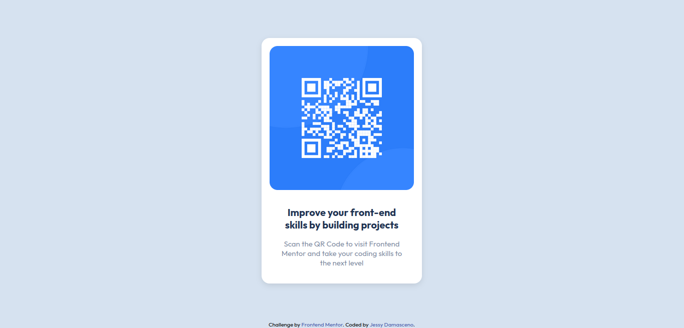

# Frontend Mentor - QR code component solution

This is a solution to the [QR code component challenge on Frontend Mentor](https://www.frontendmentor.io/challenges/qr-code-component-iux_sIO_H). Frontend Mentor challenges help you improve your coding skills by building realistic projects. 

## Table of contents

- [Overview](#overview)
  - [Screenshot](#screenshot)
  - [Links](#links)
- [My process](#my-process)
  - [Built with](#built-with)
  - [Useful resources](#useful-resources)
- [Author](#author)

## Overview

### Screenshot

### Links

- Solution URL: [Add solution URL here](https://your-solution-url.com)
- Live Site URL: [Add live site URL here](https://your-live-site-url.com)

## My process

### Built with

- Semantic HTML5 markup
- CSS custom properties
- Flexbox
- Mobile-first workflow

### Useful resources

- [Creating variables in CSS](https://developer.mozilla.org/pt-BR/docs/Web/CSS/:root) - This helped to create the base CSS. I really liked this pattern and will use it going forward.
- [Box shadow templates](https://getcssscan.com/css-box-shadow-examples) - This is an amazing article with awesome box shadow templates.

## Author

- Website - [Jessy Damasceno](https://www.your-site.com)
- Frontend Mentor - [@jessy-damasceno](https://www.frontendmentor.io/profile/jessy-damasceno)
- GitHub - [jessy-damasceno](https://github.com/jessy-damasceno)
